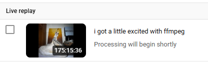

# the ffmpeg-youtube-goon project

24/7 YouTube radio stream with glitch video effects and dynamic track info overlay.

i run this personally at https://youtube.com/@thecollabagepatch sometimes.

what it looks like here:

https://youtu.be/10HhjlhGHbo

personal record for up-time: 175hrs



## Quick Start

```bash
cd scripts
npm install
cp .env.example .env
# Edit .env with your YOUTUBE_STREAM_KEY

pm2 start playlist-pusher.js
pm2 start multi-audio-stream.js
```

Requires nginx with RTMP module. See [SETUP.md](SETUP.md) for full installation guide.

## Project Structure

```
radio-stream/
├── scripts/
│   ├── playlist-pusher.js     # Shuffles & streams audio to local RTMP
│   ├── multi-audio-stream.js  # Adds video effects, pushes to YouTube
│   ├── playlist-manager.js    # Track metadata & playlist utilities
│   ├── ecosystem.config.js    # pm2 config
│   ├── testcard.mp4           # Background video loop
│   └── yt_links.txt           # Additional track metadata
├── audio/                     # MP3 files organized by folder
│   ├── CC_1_Files/
│   ├── CC_2_Files/
│   ├── CC_3_Files/
│   ├── LDT_Files/
│   └── ...
└── overlay/                   # Overlay assets (if any)
```

## How It Works

1. **playlist-pusher.js** randomly shuffles audio files with weighted preferences, encodes to mpegts, and pushes to a local nginx RTMP server
2. **nginx-rtmp** acts as a local relay at `rtmp://localhost/live/stream`
3. **multi-audio-stream.js** pulls from local RTMP, applies glitch video effects (chromatic aberration, datamosh, scanlines, etc.), overlays track info from `title.txt`/`description.txt`, and streams to YouTube

## License

MIT or something? idk use this, make it cooler, and shout me out. that's all i rly care about.